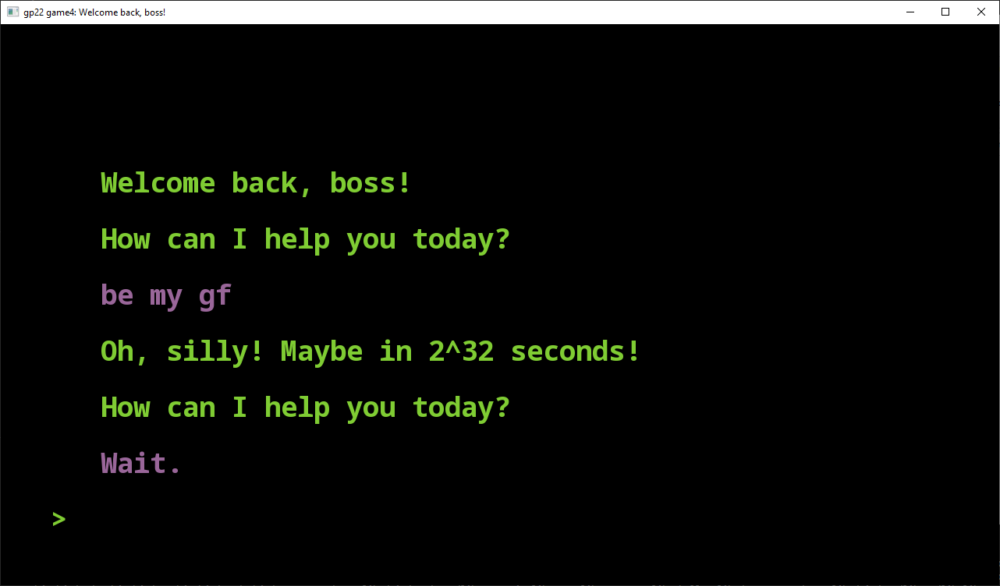

# Welcome back, boss!

Author: Alan Lee / soohyun3

Design: You are a spy who wants to extract the nuclear launch code from your boss! Defeat the computer security to obtain the code!

Text Drawing: The texts are rendered at runtime. Only at most 8(-ish) lines of 
texts are draw at any given moment, and the string versions of these texts are
initialized and stored as a queue form using `std::vector`s. Once we know which
strings, locations, and colors to draw the text at (all extracted from the 
custom vectors), I use Harfbuzz and Freetype to shape and render the glyphs.
Lastly, OpenGL was used to provide actual textures to be drawn on screen.

Choices: All of the choices and narratives are initialized and stored inside 
`PlayMode.cpp`'s `PlayMode()`. The idea is like reading a tape machine, you 
only read from right to left (or back to front) of the (improperly named) stack
 of commands. Each command has a distinct first code that identifies whether 
the game should 1. print the message 2. update last message sent 3. provide a 
set of user choice and wait 4. perform a special check 5. terminate. Then it 
stores the string relevant to the task (set to empty string if not needed), the
 amount of time in milliseconds to be waited before executing this task, and 
color assignment for the text color. The "jumping" of this one-directional tape
 machine occurs when the user makes a choice. The (again improperly named) 
choice stack contains vectors of options in strings and corresponding number of
 operations to skip. You can think of this like those "Choose Your Own 
Adventure" series styled execution.

Screen Shot:

How To Play:

This is a narrative-driven game, so not much you need to do control-wise (it's also very short). 
Whenever you are given a choice, make sure to choose wisely, keeping in mind
that you want to extract the information *secretly*.

Also, don't forget to read the messages *carefully*.

Sources:

The font used in this game comes from https://fonts.google.com/noto/specimen/Noto+Sans+Mono, which is under the [Open Font License](https://scripts.sil.org/cms/scripts/page.php?site_id=nrsi&id=OFL).

Programming inspirations are commented with relevant links at points of references.

This game was built with [NEST](NEST.md).

